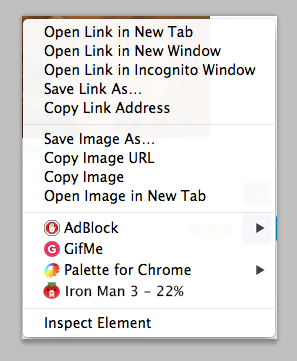

# Automato

Chrome extension that displays [Rotten Tomatoes](https://www.rottentomatoes.com/) film ratings in the browser context menu (the right-click menu).
Note: RT now restricts access to their API and this extension is no longer functional.

## Installation
1. Clone or download Automato.
2. In Chrome, navigate to the extensions menu.
3. Click "Load unpacked."
4. Select the root Automato director.

## Usage
Highlight any film title in Chrome and right-click to see the Rotten Tomatoes rating. Click the menu item to navigate to RT.

